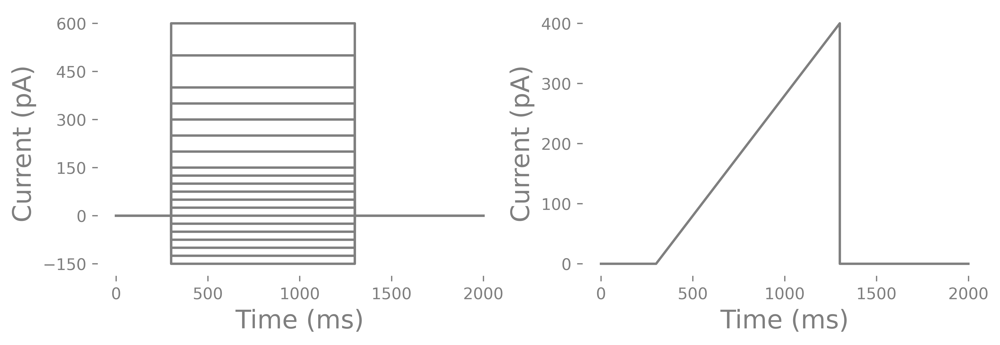

(current_clamp)=
# Current clamp
Current clamp recordings are one of the most common patch-clamp experiment. Current clamp experiments allow you to get the active parameters of cells. Namely gain, rheobase and spike threshold. Current clamp recordings typically use stepped currrent injections or ramps and you are investigating the voltage change due to the current injection and whether and how the cell spikes. The current clamp chapter is divide into two parts. The first part is a basic analysis and covers what features we look for and why they are important. The second part will delve much deeper in relationships between spike features and cover differences between a few cell types; pyramidal cells, spiny projection neurons and parvalbumin interneurons.

## Experimental considerations for current clamp recordings
### Internal and external solutions
You will need to a standard ACSF for recording. Many labs mantain the ACSF at physiological temperatures which is considered ~32&deg;C however you can record at room temperature but, reviewers may not like it. I recommend recording at 32&deg;C. You can include drugs in the bath to block synaptic activity but do not need to include these. If you are having a lot of recurrent input that is driving spikes, depolarizations or hyperpolarizations in your cells if may be good to include some drugs to block synpatic currents. The one problem with blocking synaptic currents there can be homestatic changes in cell functin due to changes in or lack of synaptic input. These are considerations you need to consider. I would recommend starting without any drugs in the bath to keep it simple.

### To use a holding current or not
One thing to consider is whether you should inject a holding current to bring the cell to a specific resting potential value. Many studies inject some current to hold the cell at around -70mV or the cell types preferred membrane voltage and run their current pulses or ramps based on that holding current. There are a few studies that do not inject any holding current and even argue against injecting any holding current. The question is whether rheobase is the current it takes to get a cell to spike from a specific membrane voltage or from where the resting membrane potential is? Here is an example to consider. It takes 50 pA to get a layer 5 pyramidal in a WT mouse to fire an action potential from -70 mV and in a knockout mouse it takes 100 pA. However, the WT mouse cells sits a -70 mV at baseline where as knockout mouse sits as -60 mV. What if there is no difference in the rheobase current? What if there is a difference in rheobase current but no difference in resting membrane potential? 

Another factor to consider is that some cells, such as dopaminergic cells, VTA interneurons or SST cells, spontaneously spike in slices, even with high Mg+ (2 mM). To test rheobase you have to inject some current so you will likely need to at least hold them below the spike threshold. I have read that you cannot actually test rheobase in these cells because they are spontaneously firing. Instead you can see how much current it takes to suppress the spontaneous firing. On the other hand many internals used for current clamp experiments primarily composed of K+ which I have found spontaneous firing to cease in many of these cells upon break in.

### Steps vs ramps
As mentioned in the beginning, you can record stepped currents or ramps. Stepped currents are the most common. Usually there are negative and positive steps. The negative steps can go as low as -150 to -200 pA and positive currents can as high as 600 pA (some interneurons have a very high rheobase), Steps can be irregular or regularly spaced. One problem with ramps is that some cells have depolarization block and may not spike during a ramp but will during a set of stepped pulses. Depolarization block is the inactivation of voltage-gated sodium channels due to long membrane depolarizations that does not elicit any spikes. There are conditions, such as epilepsy, where depolarization block may actually be a feature of the altered cell physiology and you could use the ramp to test whether this occurs. Below you can see and example current injection cycle and a ramp. 

How do you determine the length of a current injection? You can do short 3 ms long pulses or long 1000 ms long pulses. You can use short and steep ramps or slow and long ramps. You all of these and compare each. However, most commonly you will find that labs use a 500-1000 ms current injection. This is considered infinitely long. The reason has to do with rheobase and a related feature call chronaxie which I will explain below. You may also notice that in some cells the membrane potential slowly increases after the initial current injection until the cell spikes where as other cells, particularly PV interneurons, do not have an increase in membrane potential.
Lastly you should consider whether or not you want to run multiple cycles of the pulses. Some labs only run one cycle with small steps to save time. Other labs run several cycles/epochs and average each of the cycles/epochs. One thing I will point out is that neurons are probablistic and priors can changes how a neurons is likely to function. Some would argument that a cycle of current injections will alter the function of a neuron. Others will argue that because neurons are probablistic you need to to run several cycles to get the central tendency of a particular characteristic (like rheobase) of a cell. The analysis I will go through uses the cycle/epoch. Remember that infinity long current injections that we do are not normal input for most cells so we are already

### What is rheobase?
Rheobase is one the key parameters researchers extract from current clamp data. Rheobase is consider the minimal current it takes to get a cell to fire an action potential when using an infinite duration current injection. It is based off a curve called the Lapicque hyperbolic strength-duration curve. This curve is a decaying exponetial curve and rheobase is essentially the steady state of the duration if the stimulus is infinite.
Earlier I went over how you could deal with cells that are spontaneously spiking. I have heard some arguments that you cannot even test rheobase in these cells types. If you do not want to hold the cell at -70 or so then you can specify rheobase as the minimum current needed to suppress spontaneous firing. This might make sense for cells that receive very little excitatory input but a lot of inhibitory input.

### What is spike threshold?
Spike threshold is the voltage threshold at which a spike will occur. This point is called a bifurcation point where there is bifurcation in the function of a neuron. This bifurcation point and how is relate to the function of a neuron can be explained by dynamical systems. The spike threshold is a not a fixed threshold. It depends on the previous membrane voltage and the change (dV/dt) in membrane voltage. For example, PV interneurons typically do not spike when using ramp injections. PV interneurons need a large and sudden (i.e highly syncrhonous) synpatic/current input. Previous spiking activity also changes the spike threshold of a neuron as we will see in part 2 of the current clamp analysis. The flexibility of the spike threshold is a way for neurons to increase or decrease synchronization, feature selectivity, gain, etc. on the fly.